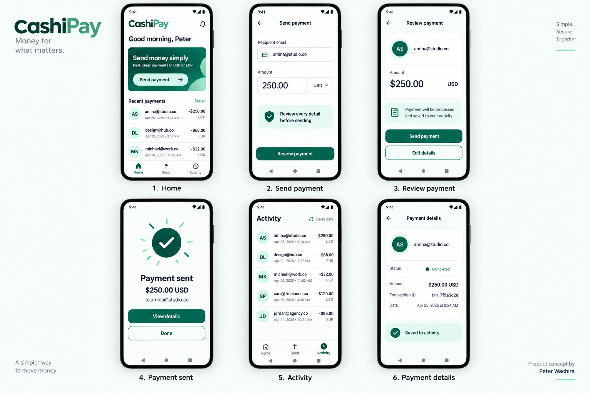
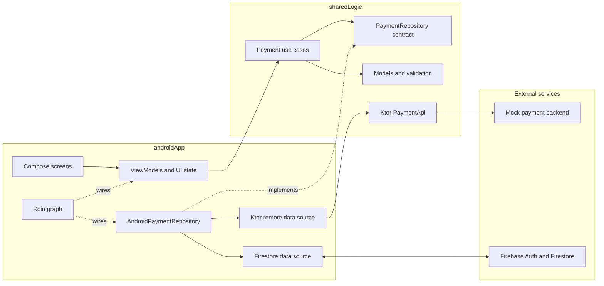
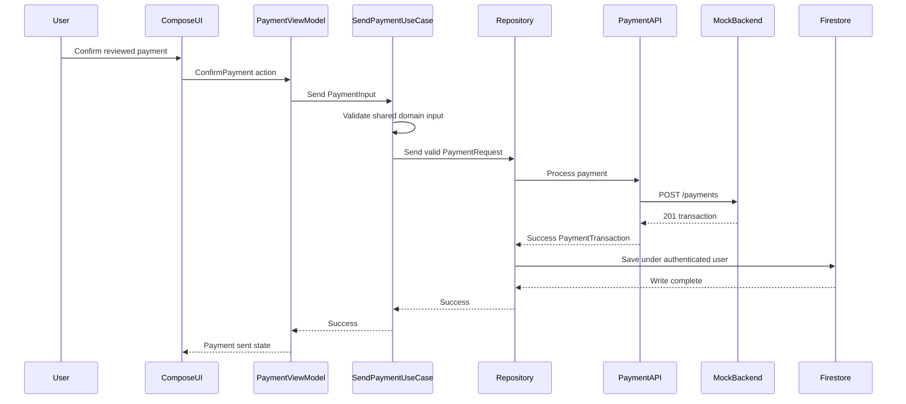
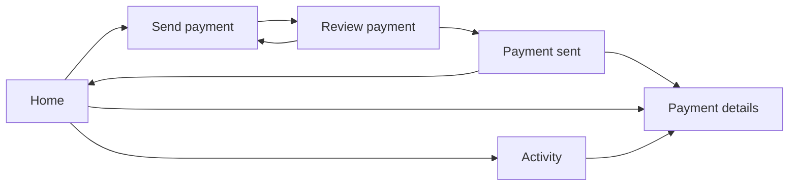

# CashiPay

CashiPay is an Android-first Kotlin Multiplatform payment challenge. It
validates payment details in shared code, processes payments through a small
REST service, persists successful transactions to Firebase Firestore, and
displays real-time activity in Jetpack Compose.

The project deliberately shares business logic rather than UI. Android is the
complete product surface; the iOS target proves that the shared framework builds
and provides a future integration point.



_Product concept by Peter Wachira. Compose screens are the implementation source
of truth._

## What is implemented

- Home dashboard with recent outgoing payments
- Send-payment form for recipient email, amount, and USD/EUR currency
- Shared validation and type-safe payment value objects
- Review-before-send confirmation step
- Ktor `POST /payments` integration
- Successful-payment persistence under the authenticated Firebase user
- Real-time Firestore activity with loading, empty, error, and content states
- Payment success and ID-based transaction details screens
- Koin dependency injection and Compose Navigation
- Shared, repository, mapper, ViewModel, formatter, API, and backend tests
- BDD scenarios and a five-user JMeter load plan
- CI gates for tests, lint, Android assembly, the backend, and final KMP/iOS
  checks

## Architecture

The implementation uses practical Clean Architecture boundaries with MVVM at the
Android presentation layer. A sealed action contract provides one clear UI-event
entry point without introducing a reducer-based MVI framework.



### Payment processing sequence

The backend is the payment processor; Firestore is the Android activity store. A
transaction is only persisted after the backend returns success.



### Real-time activity flow


The listener is removed by `awaitClose` when collection ends. Routes use
`collectAsStateWithLifecycle`, so Android UI collection follows the visible
lifecycle instead of keeping unnecessary work active in the background.

### Navigation flow



Navigation passes a transaction ID to the details destination rather than
serializing a full domain object. The destination resolves current data from the
Firestore-backed stream.

## Module responsibilities

| Area                      | Responsibility                                                                                           |
| ------------------------- | -------------------------------------------------------------------------------------------------------- |
| `sharedLogic/commonMain`  | Value classes, money model, validation, repository contract, use cases, DTO mapping, and Ktor API client |
| `sharedLogic/commonTest`  | Platform-independent validation, use-case, mapper, value-type, and API tests                             |
| `androidApp/data`         | Firebase authentication, Firestore mapping/listening, remote adapter, and repository implementation      |
| `androidApp/presentation` | MVVM state/actions, ViewModels, Compose routes/screens, theme, and navigation                            |
| `mock-backend`            | Dependency-free Node.js `/payments` and `/health` service                                                |
| `testing`                 | Gherkin acceptance scenarios and JMeter performance plan                                                 |
| `iosApp`                  | Buildable future host for the shared KMP framework; full iOS UI is intentionally out of scope            |

## Key design choices

- Money uses integer minor units, such as `2500` for USD 25.00, to avoid binary
  floating-point rounding in the domain.
- `RecipientEmail`, `TransactionId`, and `MinorUnits` are value
  classes/factories that prevent invalid primitive values from spreading through
  the app.
- Use cases depend on the shared `PaymentRepository` interface; the Android
  repository supplies Firebase and remote implementations through dependency
  inversion.
- UI state is immutable. ViewModels expose read-only `StateFlow` and receive
  sealed actions.
- Route composables own ViewModel/lifecycle integration; screen composables
  remain stateless and receive values plus callbacks.
- Firebase stays Android-specific because Android is the required client. Moving
  Firebase behind a multiplatform SDK was not justified for this challenge.

See the complete decision records in [`docs/adr`](docs/adr/README.md).

## Technology

- Kotlin Multiplatform and Kotlin Coroutines/Flow
- Jetpack Compose Material 3
- AndroidX Lifecycle and Navigation Compose
- Ktor client with Kotlinx Serialization
- Koin
- Firebase Anonymous Auth and Cloud Firestore
- Node.js built-in HTTP server and test runner
- JUnit, Kotlin Test, MockK, and coroutine test utilities
- GitHub Actions, Dependabot, and JMeter

## Prerequisites

- Android Studio with Android SDK 36 or newer installed
- JDK 17
- Node.js 20 or newer
- Xcode and command-line tools for iOS/Kotlin Native verification
- Optional: Apache JMeter 5.6.x for the load plan

## Firebase setup

The challenge Firebase client configuration is located at
`androidApp/google-services.json`. Firebase client configuration identifies a
project but is not an administrative service-account credential. Firestore
access is still restricted by authentication and
[`firestore.rules`](firestore.rules).

For your own Firebase project:

1. Create an Android app with package name `com.peterwachira.cashipay`.
2. Replace `androidApp/google-services.json` with the downloaded client
   configuration.
3. Enable Anonymous authentication.
4. Create a Firestore database.
5. Deploy the repository rules with `firebase deploy --only firestore:rules`, or
   paste them into the Firebase console.

Transactions are stored at:

```text
users/{authenticatedUserId}/payments/{transactionId}
```

The rules allow an authenticated user to read and create only their own valid
payment documents. Client update and delete operations are denied.

## Run the app

Start the local processor from the repository root:

```bash
cd mock-backend
npm test
npm start
```

Then run `androidApp` on an Android emulator from Android Studio. The debug
build uses `http://10.0.2.2:8080`, which maps the emulator to the host machine.
Cleartext traffic is enabled only in the debug manifest.

For a physical device, either expose the backend over a reachable HTTPS URL or
change the debug endpoint to the host machine's LAN address.

A usable release build should receive its HTTPS endpoint as a Gradle property:

```bash
./gradlew :androidApp:assembleRelease \
  -PCASHIPAY_API_BASE_URL=https://payments.example.com
```

Without that property, release builds use the non-routable
`https://example.invalid` value so a release cannot accidentally call the
emulator backend.

## Verification

Run the primary local quality gate:

```bash
./gradlew \
  :sharedLogic:check \
  :androidApp:testDebugUnitTest \
  :androidApp:lintDebug \
  :androidApp:assembleDebug \
  :androidApp:assembleRelease
```

Run backend tests:

```bash
cd mock-backend
npm test
```

Build the iOS host without signing:

```bash
xcrun xcodebuild \
  -project iosApp/iosApp.xcodeproj \
  -scheme iosApp \
  -sdk iphonesimulator \
  -configuration Debug \
  CODE_SIGNING_ALLOWED=NO \
  build
```

### Test strategy

| Level             | Evidence                              | Purpose                                                                           |
| ----------------- | ------------------------------------- | --------------------------------------------------------------------------------- |
| Domain unit       | `sharedLogic/src/commonTest`          | Validation, type safety, use-case behavior, DTO mapping, and API responses        |
| Android unit      | `androidApp/src/test`                 | Repository orchestration, Firestore mapping, ViewModel state, and formatting      |
| Backend black box | `mock-backend/test`                   | HTTP status, content-type, routing, and payment behavior through public endpoints |
| BDD specification | `testing/bdd/payment.feature`         | Reviewable Given/When/Then acceptance behavior                                    |
| Performance       | `testing/performance/payment-api.jmx` | Five concurrent users, ten payments each, and HTTP 201 assertions                 |
| CI                | `.github/workflows/android-ci.yml`    | Repeatable tests, lint, assembly, backend checks, and final iOS checks            |

The Gherkin file is an acceptance specification rather than a Cucumber runtime
dependency. The same behavior is enforced by focused unit and black-box tests
without adding a second overlapping test framework.

Start the backend, then run the JMeter plan in non-GUI mode:

```bash
jmeter -n \
  -t testing/performance/payment-api.jmx \
  -Jhost=localhost \
  -Jport=8080 \
  -l build/jmeter-results.jtl \
  -e -o build/jmeter-report
```

Appium was listed as optional in the challenge. It is not included because
stable accessibility selectors, emulator provisioning, and an end-to-end
Firebase test environment deserve a deliberate implementation rather than a
brittle showcase test.

## CI and branch workflow

Feature and maintenance branches target `develop`. Each meaningful slice is
reviewed and merged separately. Only `develop` is allowed to open the final pull
request to `master`.

The balanced CI policy runs Android/shared JVM tests, lint, debug assembly, and
backend tests on feature pull requests. The more expensive Kotlin/Native iOS
check runs on the final `develop` to `master` pull request.

## Demo

See [`docs/DEMO_SCRIPT.md`](docs/DEMO_SCRIPT.md) for a short presentation flow
covering validation, review, backend processing, Firestore synchronization, and
architecture discussion.

## Known limitations

- Anonymous authentication is appropriate for this challenge, not for a real
  financial identity model.
- The backend is local and stateless; it does not provide authorization,
  idempotency keys, durable storage, fraud controls, or real payment-rail
  integration.
- Firestore records backend timestamps but does not yet verify them through a
  trusted production payment service.
- A backend success followed by a Firestore write failure is surfaced clearly,
  but production systems would use idempotency and server-side persistence to
  reconcile that partial failure.
- The Android app is complete; a native iOS presentation/data implementation is
  future work.
- Automated Compose/Appium end-to-end testing is not included.

## Next production steps

1. Move payment persistence and Firebase writes behind a trusted backend with
   authenticated user tokens and idempotency.
2. Replace anonymous auth with the product identity flow and strengthen App
   Check/API-key restrictions.
3. Add a hosted HTTPS environment with separate debug, staging, and production
   configuration.
4. Add deterministic Firestore emulator integration tests and Compose UI tests.
5. Add observability, retry/reconciliation policy, and accessibility automation.

## Additional documentation

- [Architecture decision records](docs/adr/README.md)
- [UI specification](docs/design/CASHIPAY_UI_SPEC.md)
- [Mock backend guide](mock-backend/README.md)
- [Demo script](docs/DEMO_SCRIPT.md)
